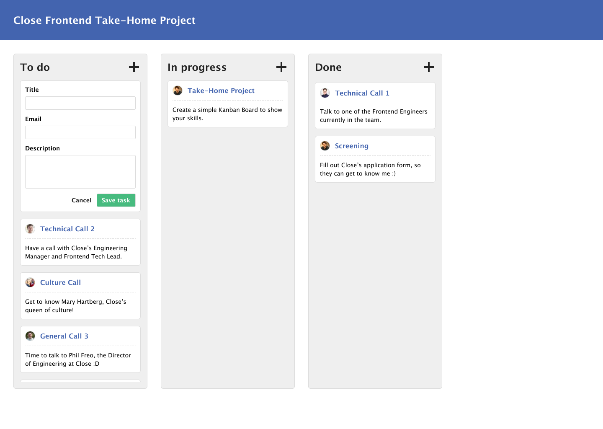

# Close Frontend Take-Home Challenge

_Context: If you're seeing this, it means we'd like to see how you would solve a real-world problem. But to be totally clear, we won't be using your design or code for anything beyond deciding on moving forward in the hiring process._

## Kanban Board

### Overview / Background

Your goal is to implement a simple Kanban Board that allows users to create tasks and move them between columns.

You can assume the screen you'll build would live within a larger web application. This challenge is only concerned with helping users manage tasks of a particular project. You don't need to be concerned with the navigation between screens.

### Design spec

Click the image below to open the Design spec in Figma.

### UI/UX Requirements

- The layout/design must match the spec above.
- There must be three columns:
  - To do
  - In progress
  - Done
- Each column may contain N cards (maximum of 100).
- Each card must show a [Gravatar](https://en.gravatar.com/site/implement/images/), a title, and a description.
- The user can drag the card around (drag within a column to re-order or move it to another column).
- The user can add a new card by clicking `+` on any of the columns.
- The board must take the entire height of the available screen (respecting the spacing around it).
- Each column must be scrollable, although its header must remain fixed.
- The changes must be persisted after a refresh (only locally).
- In case the board is open in two different tabs: whenever something changes on one tab, the others must be updated.

### Technical Requirements

- Create sensible git commits as you work on a solution.
- The starting point is `src/components/screens/Board`, you can edit from there and create as many files as you want.
- You may install 3rd party libraries to simplify the development.
- The board data must be saved in the `localStorage`.
- You must use React hooks (preferred) or React classes to build the UI.
- You may manage state in whatever way you want.
- Make sure to avoid re-rendering of other cards when creating/moving a card.
- We expect you to write at least a few tests.

### Grading criteria

The ordering of criteria is arbitrary.

- Implementing all required functionality.
- Code quality and structure should be your #1 goal.
- Creating great UX/UI.
- Self-critique (see below)

### Goal and deliverables

Create a `.zip` of your solution and a `README.md` file.

The `README.md` should resemble a pull request description.
It needs to include:

- A quick outline/commentary on your UI and technical decisions with a self-critique.
- Screenshots/GIFs of your UI and interactions.
- What tests you performed.
- What you would continue iterating on if you had more time.

We will use the git commit history and the `README.md` to review your solution as if it was a pull request.

To submit, email a link to a (private) `.zip` from GDrive or Dropbox to [mary@close.com with subject "Frontend Take-Home"](mailto:mary@close.com?Subject=Frontend%20Take-Home). Please don't publish the project or code publicly.
